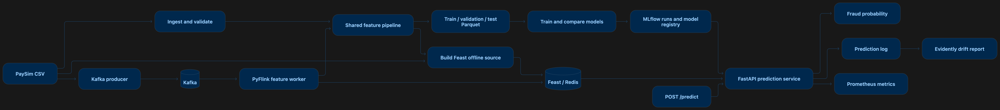

# Real-Time Fraud Detection MLOps Platform

An MLOps platform for real-time fraud detection using the
[PaySim](https://www.kaggle.com/datasets/ealaxi/paysim1) synthetic
mobile-money transaction dataset. It trains and tracks models offline,
computes live features from Kafka with PyFlink and Feast, and serves
predictions through FastAPI. Prometheus, Grafana, Evidently, Airflow,
and Kubernetes support monitoring and operations. See the [roadmap](#roadmap)
for milestone status and remaining work.

## Contents

- [Project overview](#project-overview)
  - [Architecture overview](#architecture-overview)
  - [Project and package layout](#project-layout)
- [Getting started](#getting-started)
  - [Requirements](#requirements)
  - [Setup](#setup)
  - [Common tasks](#common-tasks)
  - [Configuration](#configuration)
  - [Logging](#logging)
- [Core workflows](#core-workflows)
  - [Model training and MLflow](#model-training--mlflow)
  - [Kafka streaming](#kafka-streaming)
  - [Real-time feature platform](#real-time-feature-platform-feast--redis--flink)
  - [Real-time inference API](#real-time-inference-api-fastapi--feast--mlflow)
  - [Observability](#observability-prometheus--grafana--evidently-ai)
- [Deployment and operations](#deployment-and-operations)
  - [Other local infrastructure](#other-local-infrastructure)
  - [Kubernetes deployment](#kubernetes-deployment)
  - [Airflow orchestration](#airflow-orchestration)
  - [Live demo dashboard](#live-demo-dashboard)
- [Roadmap](#roadmap)

## Project overview

### Architecture overview



### Project layout

| Path | Purpose |
|------|---------|
| `src/fraud_detection/` | Installable Python application |
| `data/` | Raw data, processed splits, contracts, Feast source, and prediction logs; generated data is gitignored |
| `feast_repo/` | Feast entity, feature view, and store configuration |
| `configs/` | Environment overlays and logging configuration |
| `mlruns/` | Local MLflow tracking store (gitignored) |
| `dashboard/` | Local Streamlit live demo |
| `docker/`, `docker-compose.yml` | Images and local infrastructure |
| `kubernetes/`, `airflow/` | Cluster deployment and scheduled workflows |
| `tests/`, `.github/workflows/` | Pytest suite and CI |
| `requirements/`, `Makefile` | Pinned dependencies and task shortcuts |
| `docs/`, `scripts/` | Architecture decisions, generated reports, and utilities |

#### Package layout

`src/fraud_detection/` separates `domain` entities, `data` preparation,
shared `features`, `models`, Kafka/PyFlink `streaming`, the FastAPI
`api`, `monitoring`, and `common` configuration/logging. `cli.py` is
the `fraud-detection` command entry point. See
[docs/architecture.md](docs/architecture.md) for layer dependencies and
[docs/decisions/](docs/decisions/) for design rationale.

## Getting started

### Requirements

- Python 3.11
- The PaySim CSV (`PS_20174660362_1_log.csv` from
  [Kaggle](https://www.kaggle.com/datasets/ealaxi/paysim1)) placed at
  `data/raw/PS_20174660362_1_log.csv` before running the data pipeline.
- Docker + Docker Compose, running, before using `producer`/`consumer`/
  `materialize`/`flink-worker`/`api` or their tests (they need real
  Kafka at `localhost:9092` and/or Redis at `localhost:6379`).
- A JDK (11, 17, or 21) for PyFlink, e.g. `brew install openjdk@17`,
  with `JAVA_HOME` set — see "Real-time feature platform" below.

### Setup

```bash
python3.11 -m venv .venv
source .venv/bin/activate

make install-dev   # installs dev deps, the package (editable), and git pre-commit hooks
```

Use the Makefile install targets: PyFlink requires `setuptools<81`
and `--no-build-isolation`, which they handle.

### Common tasks

| Area | Commands |
|------|----------|
| Code quality | `make lint`, `make format`, `make typecheck`, `make test`, `make precommit` |
| Data preparation | `make ingest`, `make validate`, `make preprocess` |
| Models | `make train`, `make evaluate` |
| Kafka | `make kafka-up`, `make producer`, `make consumer`, `make kafka-down` |
| Features | `make redis-up`, `make infra-up`, `make flink-jar`, `make feast-apply`, `make materialize`, `make flink-worker`, `make infra-down` |
| API | `make api`, `make ready`, `make api-build`, `make api-up`, `make api-down` |
| Monitoring | `make monitoring-up`, `make monitoring-down`, `make drift-report` |

The Makefile wraps the CLI, Docker Compose, and code quality tools.
Run `fraud-detection --help` or
`fraud-detection <command> --help` to see overridable paths, topics,
ports, and other options. For example:

```bash
fraud-detection preprocess --raw-path data/raw/PS_20174660362_1_log.csv --output-dir data/processed
fraud-detection train --tracking-uri file:./mlruns --experiment-name paysim-fraud-detection
fraud-detection producer --topic transactions --rate 5 --limit 1000
fraud-detection drift-report --reference-sample-size 5000 --output-path docs/drift_report.html
```

### Configuration

Configuration is split into `configs/base.yaml` (shared defaults) plus an
environment overlay (`configs/dev.yaml`, `configs/prod.yaml`) that's
deep-merged on top. Loaded via:

```python
from fraud_detection.common.config import load_config

config = load_config("dev")  # or load_config() to use APP_ENV, defaulting to "dev"
```

### Logging

Structured JSON logging is configured in `configs/logging.yaml` and
initialized via `fraud_detection.common.logger`:

```python
from fraud_detection.common.logger import get_logger

logger = get_logger(__name__)
```

## Core workflows

### Model training & MLflow

`fraud-detection train` trains Logistic Regression, Random Forest,
XGBoost, and LightGBM on `data/processed/` (already feature-engineered
by `fraud-detection preprocess`), handles the ~0.13% fraud imbalance via
class weighting, and logs every run to a local MLflow file store
(`mlruns/`, gitignored) — params, metrics, the model artifact,
`feature_version` (from `fraud_detection.features.registry`), and the
git commit hash. The run with the best **validation** `average_precision`
(PR-AUC — the meaningful metric here, since accuracy is ~99.87% even for
a model that never predicts fraud) is registered under
`fraud-detection-classifier` in the MLflow Model Registry. Browse runs
with:

```bash
mlflow ui --backend-store-uri file:./mlruns
```

### Kafka streaming

`docker-compose.yml` runs a single-node KRaft Kafka broker and
[Kafka UI](https://github.com/provectus/kafka-ui) at
[localhost:8080](http://localhost:8080). Start the broker and check its
health before producing messages:

```bash
make kafka-up
docker compose ps kafka
```

In separate terminals, start the consumer and then the producer:

```bash
fraud-detection consumer --topic transactions
fraud-detection producer --topic transactions --rate 5 --limit 200
```

The producer removes the historical `isFraud` label and sends JSON
serialized from the shared `Transaction` entity. This consumer only
logs messages; the PyFlink worker below computes live features. The
single-broker replication settings and KRaft cluster ID are explained
in [docker-compose.yml](docker-compose.yml) and [ADR-0005](docs/decisions/0005-reuse-domain-entity-for-kafka-messages.md).

### Real-time feature platform (Feast + Redis + Flink)

The PyFlink worker reads Kafka transactions and calls
`FeaturePipeline.transform_one()`, which delegates to the batch
`transform()` method. It pushes the nine engineered features through
Feast into Redis. For batch materialization, `materialize` computes
features from a PaySim sample,
writes `data/feast/transaction_features.parquet`, and runs Feast
materialization. Both paths use the same feature definitions. See
[ADR-0006](docs/decisions/0006-feast-redis-flink.md).

#### One-time setup

```bash
brew install openjdk@17
export JAVA_HOME="/opt/homebrew/opt/openjdk@17"   # add to your shell profile
export PATH="$JAVA_HOME/bin:$PATH"
make flink-jar   # download the Flink Kafka connector JAR
```

#### Run the feature pipeline

```bash
make infra-up       # Kafka and Redis
make feast-apply    # register Feast definitions
make materialize    # populate Redis from the offline source
make flink-worker   # continuously process Kafka transactions
```

In another terminal, produce transactions:

```bash
fraud-detection producer --topic transactions --rate 5 --limit 200
```

The worker prints an `entity_id` for each processed transaction.
Verify an online lookup with:

```python
from fraud_detection.features.feast_store import FeastFeatureStore
from fraud_detection.features.feast_ops import DEFAULT_FEAST_REPO_PATH
from fraud_detection.features.feast_prep import DEFAULT_OFFLINE_SOURCE_PATH

store = FeastFeatureStore(DEFAULT_FEAST_REPO_PATH, DEFAULT_OFFLINE_SOURCE_PATH)
store.read_online("<entity_id from the flink-worker log line>")
```

`fraud-detection flink-worker --bounded` stops at the latest Kafka
offset present when the job starts. Redis/Kafka/Flink integration tests
run when those services, a JDK, and the connector JAR are available;
otherwise they skip. Use `make infra-up`, `make flink-jar`, then
`make test` to run them.

### Real-time inference API (FastAPI + Feast + MLflow)

`POST /predict` derives the transaction's Feast entity ID, reads its
nine engineered features from Redis, combines them with raw request
fields, and orders the columns exactly as recorded for the MLflow model.
The API loads the model in MLflow's **Production** stage once at
startup. If the transaction's features are absent, it returns 503
instead of recomputing them. See [ADR-0007](docs/decisions/0007-fastapi-inference-service.md).

| Method | Path | Purpose |
|--------|------|---------|
| GET | `/health` | Process liveness |
| GET | `/ready` | Model, Feast client, and Redis readiness |
| POST | `/predict` | Fraud class and probability for a transaction |
| GET | `/metrics` | Prometheus metrics |
| GET | `/docs` | Interactive OpenAPI documentation |

#### Promote a model once

`fraud-detection train` registers its best model but does not promote
it. Promote the version to serve, then start or restart the API:

```python
from mlflow.tracking import MlflowClient

MlflowClient().transition_model_version_stage(
    name="fraud-detection-classifier", version=1, stage="Production"
)
```

#### Run locally

```bash
make infra-up
make feast-apply
make materialize    # or populate Feast through Kafka and flink-worker
make api            # http://localhost:8000
```

In another terminal:

```bash
make ready
curl -X POST localhost:8000/predict -H "Content-Type: application/json" -d '{
  "step": 1, "type": "TRANSFER", "amount": 181.0, "nameOrig": "C1231006815",
  "oldbalanceOrg": 181.0, "newbalanceOrig": 0.0, "nameDest": "C1666544295",
  "oldbalanceDest": 0.0, "newbalanceDest": 0.0
}'
```

#### Run with Docker Compose

```bash
make infra-up
make feast-apply
make materialize
make api-build
make api-up
```

Promote a model before starting the container. The Compose API uses the
host's local `mlruns/` store and mounts `feast_repo/`; its Feast config
points to `redis:6379` on the Compose network. See
[ADR-0007](docs/decisions/0007-fastapi-inference-service.md) for the
container path and Redis configuration details. `make test` covers
unit tests plus an API integration test that skips without Redis.

### Observability (Prometheus + Grafana + Evidently AI)

`/metrics` exposes request counts, errors, latency, prediction counts,
fraud-probability distribution, and Redis reachability. Each successful
`/predict` also appends the input and result to
`data/monitoring/prediction_log.jsonl`. The prediction log supplies
live data for the Evidently drift report.

#### Metrics and dashboard

```bash
make infra-up
make api-up            # or make api to run on the host
make monitoring-up     # Prometheus :9090 and Grafana :3000
```

Grafana (`admin` / `admin`, set in `docker-compose.yml`) provisions the
"Fraud Detection Platform" dashboard automatically. It shows API,
model-usage, Redis, and container metrics. On Docker Desktop for Mac,
cAdvisor may leave per-container CPU/memory panels empty; see
[ADR-0008](docs/decisions/0008-monitoring.md). Kafka broker metrics
are outside the current dashboard's scope.

#### Data drift

```bash
make drift-report
open docs/drift_report.html
```

The report compares real logged requests with a PaySim reference
sample for `amount`, `type`, `oldbalanceOrg`, and `newbalanceOrig`.
It requires at least one successful `/predict` request. The platform
has no ground-truth feedback loop, so it cannot calculate live
precision, recall, or false-positive rate; probability and data drift
are the available label-free signals.

## Deployment and operations

### Other local infrastructure

`docker-compose.yml` also defines a standalone MLflow tracking server
unused by this compose stack specifically — the `api` service here
talks to the local `mlruns/` file store instead (see ADR-0007). It's
the Kubernetes deployment (below) that actually serves it. Bring the
Compose one up if needed: `docker compose up mlflow`.

### Kubernetes deployment

`kubernetes/` deploys the same system to a real local `kind` cluster —
`redis`, `kafka`, a real MLflow tracking server (`api`/`training-job`
point at it over HTTP, since K8s pods can't share a host filesystem
the way Compose's bind mount does), `api` (3 replicas, HPA-scaled
2-10 on CPU, reachable via an nginx `Ingress`), `flink-worker`, and
`prometheus`/`grafana`/`redis-exporter` mirroring the Compose
monitoring stack. See ADR-0009 for what actually broke running this
for real and how it was fixed.

One-time setup:

```bash
# Build the images kubernetes/*.yaml reference
docker build -f docker/Dockerfile.api -t mloops-api:latest .
docker build -f docker/Dockerfile.worker -t mloops-worker:latest .
docker build -f docker/Dockerfile.flink-worker -t mloops-flink-worker:latest .

# Create the cluster (run from the repo root — kind-cluster.yaml's
# extraMounts path is relative to the current working directory)
kind create cluster --config kubernetes/kind-cluster.yaml --name mloops

# Load the images into it — kind's own containerd doesn't see the
# host's Docker image store otherwise
kind load docker-image mloops-api:latest mloops-worker:latest mloops-flink-worker:latest --name mloops

# ingress-nginx and metrics-server aren't installed by kind by
# default; hpa.yaml/ingress.yaml need them
kubectl apply -f https://raw.githubusercontent.com/kubernetes/ingress-nginx/main/deploy/static/provider/kind/deploy.yaml
kubectl apply -f https://github.com/kubernetes-sigs/metrics-server/releases/latest/download/components.yaml
```

Deploy everything:

```bash
kubectl apply -f kubernetes/namespace.yaml
kubectl apply -f kubernetes/configmap.yaml -f kubernetes/secret.yaml
kubectl apply -f kubernetes/redis.yaml -f kubernetes/kafka.yaml -f kubernetes/mlflow.yaml
kubectl apply -f kubernetes/api.yaml -f kubernetes/flink-worker.yaml
kubectl apply -f kubernetes/prometheus.yaml -f kubernetes/grafana.yaml
kubectl apply -f kubernetes/jobs.yaml -f kubernetes/hpa.yaml -f kubernetes/ingress.yaml
```

`kind-cluster.yaml` configures `kind` itself and is not a Kubernetes
resource to apply.

`training-job` needs a model registered *and* promoted to
"Production" before `api` can serve real predictions (same one-time
step as Docker Compose's, see above, run against this cluster's MLflow
instead):

```python
from mlflow.tracking import MlflowClient
MlflowClient(tracking_uri="http://localhost:5000").transition_model_version_stage(
    name="fraud-detection-classifier", version=1, stage="Production"
)
# (port-forward first: kubectl port-forward -n fraud-detection svc/mlflow 5000:5000)
```

Then reach the API via the ingress controller's mapped port (see
`kind-cluster.yaml`'s `extraPortMappings`): `curl http://localhost:8090/health`.

### Airflow orchestration

Three DAGs (`airflow/dags/`) orchestrate this project's own CLI on a
schedule, each running `mloops-worker:latest` as a short-lived sibling
container via `DockerOperator` rather than reimplementing any pipeline
logic in Airflow itself:

| DAG | Schedule | What it does |
|-----|----------|---------------|
| `daily_feature_materialization` | `@daily` | extract -> validate -> preprocess -> materialize Feast |
| `weekly_retraining` | `@weekly` | preprocess -> train -> evaluate |
| `monthly_drift_report` | `@monthly` | check predictions collected -> Evidently drift report |

Runs as its own Docker Compose stack, not pip-installed into this
project's venv:

```bash
cd airflow
docker compose up airflow-init   # one-time: DB schema + admin user (admin/admin)
docker compose up -d
```

Needs the main stack's network to already exist (`docker compose up`
from the repo root at least once), and `mloops-worker:latest` built
(see the Kubernetes section above). Airflow UI: `http://localhost:8085`
(DAGs are paused on creation — unpause before triggering). Both
`weekly_retraining` and `daily_feature_materialization` run against a
small sample CSV rather than the full ~6.4M-row PaySim file, and cap
their containers at 1.5GB — see ADR-0009 for exactly why (the full
file threatens the whole Docker Desktop VM this stack and `kind` share,
not just the one task).

### Live demo dashboard

`dashboard/app.py` (`streamlit run dashboard/app.py`) streams real
PaySim transactions through the actual Kubernetes pipeline (Kafka ->
`flink-worker` -> Feast/Redis), scores each one via the deployed API's
`/predict`, and shows the prediction next to PaySim's own ground-truth
`isFraud` label plus running accuracy/precision/recall/F1 and a
confusion matrix — see `dashboard/README.md` for setup (needs a Kafka
port-forward) and ADR-0009 for two real bugs this surfaced.

## Roadmap

| Milestone | Status | Scope |
|-----------|--------|-------|
| 1 | Done | Foundation, configuration, logging, and domain layer |
| 2 | Done | PaySim ingestion, validation, preprocessing, and EDA |
| 3 | Done | Shared features, model comparison, and MLflow tracking/registry |
| 4 | Done | Kafka producer/consumer and shared transaction contract |
| 5 | Done | PyFlink, Feast, and Redis real-time feature pipeline |
| 6 | Done | FastAPI inference using Feast features and a Production-stage model |
| 7 | Done | Prometheus, Grafana, and Evidently data-drift reporting |
| 8 | Done | Kubernetes deployment, Airflow DAGs, and expanded CI |

Stress testing from the Milestone 8 brief remains undone. Live model
performance metrics also require a ground-truth feedback loop; Kafka
broker metrics are not in the current dashboard. See
[ADR-0008](docs/decisions/0008-monitoring.md) and
[ADR-0009](docs/decisions/0009-deployment-and-operations.md).
