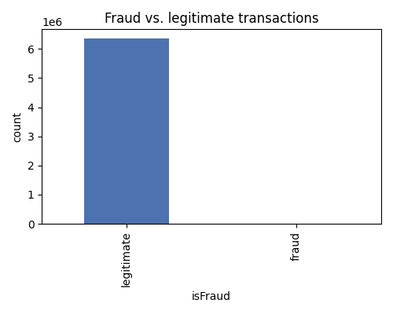
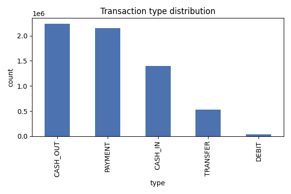
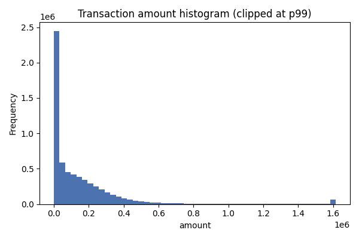
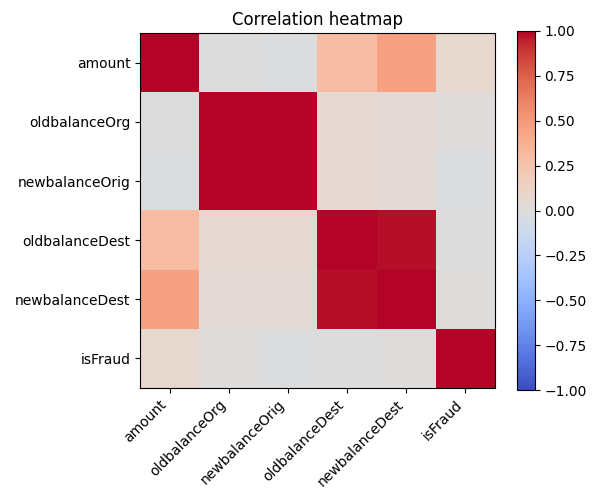

# PaySim Data Quality Report

_Generated by `fraud-detection validate`. Do not edit by hand — rerun the command instead._

## Overview

- Rows: 6,362,620
- Columns: 11
- Duplicate rows: 0
- Fraud transactions: 8,213 (0.1291%)
- Negative amounts: 0

## Missing values

No missing values.

## Transaction type distribution

| type | count |
|---|---|
| CASH_OUT | 2,237,500 |
| PAYMENT | 2,151,495 |
| CASH_IN | 1,399,284 |
| TRANSFER | 532,909 |
| DEBIT | 41,432 |

## Numerical statistics

### amount

| stat | value |
|---|---|
| count | 6,362,620.00 |
| mean | 179,861.90 |
| std | 603,858.23 |
| min | 0.00 |
| 25% | 13,389.57 |
| 50% | 74,871.94 |
| 75% | 208,721.48 |
| max | 92,445,516.64 |

### oldbalanceOrg

| stat | value |
|---|---|
| count | 6,362,620.00 |
| mean | 833,883.10 |
| std | 2,888,242.67 |
| min | 0.00 |
| 25% | 0.00 |
| 50% | 14,208.00 |
| 75% | 107,315.18 |
| max | 59,585,040.37 |

### newbalanceOrig

| stat | value |
|---|---|
| count | 6,362,620.00 |
| mean | 855,113.67 |
| std | 2,924,048.50 |
| min | 0.00 |
| 25% | 0.00 |
| 50% | 0.00 |
| 75% | 144,258.41 |
| max | 49,585,040.37 |

### oldbalanceDest

| stat | value |
|---|---|
| count | 6,362,620.00 |
| mean | 1,100,701.67 |
| std | 3,399,180.11 |
| min | 0.00 |
| 25% | 0.00 |
| 50% | 132,705.66 |
| 75% | 943,036.71 |
| max | 356,015,889.35 |

### newbalanceDest

| stat | value |
|---|---|
| count | 6,362,620.00 |
| mean | 1,224,996.40 |
| std | 3,674,128.94 |
| min | 0.00 |
| 25% | 0.00 |
| 50% | 214,661.44 |
| 75% | 1,111,909.25 |
| max | 356,179,278.92 |

## Plots

