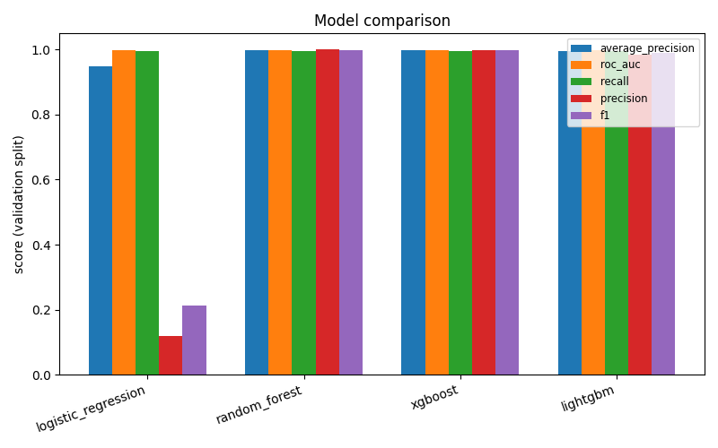

# Model Comparison Report

_Generated by `fraud-detection train`. Do not edit by hand — rerun the command instead._

## Overview

- Feature version: `d6bdfb2a6697`
- Git commit: `775c530fbf0d1c3793bf1b7e7e3a5eacd736ea28`
- Best model (by validation average_precision): **xgboost**
- Registered as: `fraud-detection-classifier` version `1`

Model selection uses **validation** `average_precision` (PR-AUC), not `accuracy` — with ~0.13% fraud, a model that always predicts "not fraud" would score ~99.87% accuracy while catching zero fraud. PR-AUC is not inflated by the large number of easy true negatives the way accuracy and ROC-AUC can be.

## Validation metrics

| model | average_precision | roc_auc | precision | recall | f1 | accuracy |
|---|---|---|---|---|---|---|
| logistic_regression | 0.9477 | 0.9992 | 0.1185 | 0.9951 | 0.2118 | 0.9904 |
| random_forest | 0.9979 | 0.9992 | 1.0000 | 0.9968 | 0.9984 | 1.0000 |
| xgboost **←best** | 0.9982 | 0.9997 | 0.9984 | 0.9968 | 0.9976 | 1.0000 |
| lightgbm | 0.9950 | 0.9973 | 0.9856 | 0.9968 | 0.9911 | 1.0000 |

## Test metrics (best model only, unused for selection)

| model | average_precision | roc_auc | precision | recall | f1 | accuracy |
|---|---|---|---|---|---|---|
| xgboost | 0.9973 | 0.9998 | 0.9951 | 0.9959 | 0.9955 | 1.0000 |

Confusion matrix (test): TP=1227, FP=6, FN=5, TN=953156

## MLflow runs

| model | run_id |
|---|---|
| logistic_regression | `77784c464215454f8e829733d762e0c5` |
| random_forest | `23d86274e2624993925e08d712e32f00` |
| xgboost | `a679a2b4faa8450e812f0d9d277b6e21` |
| lightgbm | `3df4382af8f4445a9f377cba2b207d08` |

## Plots

